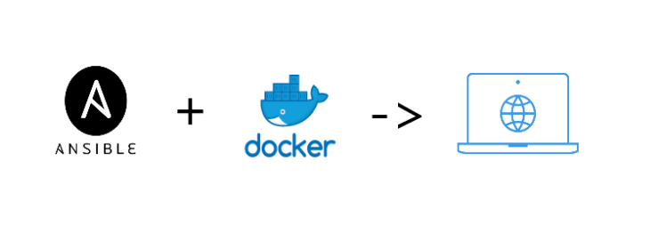

# ansible-docker-webapp

# Description:
This repository automate a Webapp deployment in Docker container using Ansible.

## Os available:
[x] Debian
[ ] RedHat
[ ] Windows server 2012
[ ] Windows server 2016

## Dependences:
* Apache

## Variables:
The default variables are [here ...](vars/main.yml)

## Usage:
 * 1 - Clone the repository : 
    * git clone 
 
 * 2 - From your working dir, move to the directory ansible-webapp/deploy_webapp : 
    * cd ansible-webapp/deploy_webapp  
 
 * Copy for webapp files to the directory deploy_webapp/files/

 * Copy for apache configuration files to the directory deploy_webapp/templates/

 * Update the files variables (vars/main.yml) with your webapp vars.

 * Add your inventory hostname in the file inventory.ini

 * Run the playbook with the follwing command (from CLI):
    * - ansible-playbook playbook.yml -i inventory.ini

## Author
* Mansour KA